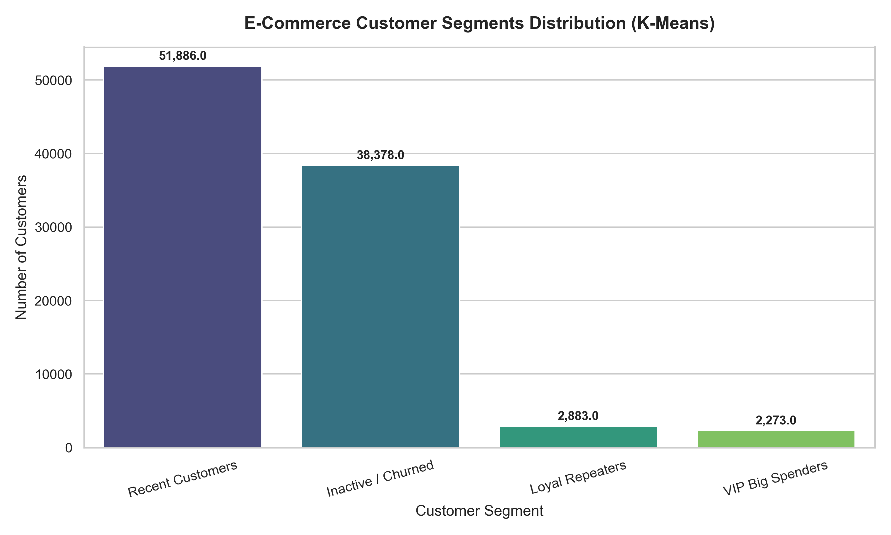

# 🛒 E-Commerce Customer Segmentation & RFM Analytics Pipeline

An end-to-end data science project that transforms raw relational e-commerce transactional data into actionable customer behavioral segments using Python, unsupervised machine learning (K-Means), and RFM (Recency, Frequency, Monetary) analysis.

---

## 📊 Project Overview
Understanding customer behavior is crucial for optimizing marketing spend, preventing churn, and maximizing customer lifetime value (CLV). This project integrates relational datasets containing over 100,000 rows of transactional records to uncover customer segments and business trends.

---

## 🛠️ Tech Stack
* **Language:** Python
* **Data Manipulation & Cleaning:** Pandas, NumPy
* **Machine Learning:** Scikit-Learn (`StandardScaler`, `KMeans`)
* **Data Visualization:** Matplotlib, Seaborn
* **Web App Deployment:** Streamlit

---

## 📈 Key Customer Segments
* **Recent Customers (51,886):** Moderate spenders who recently interacted with the platform; prime candidates for engagement campaigns.
* **Inactive / Churned (38,378):** Large segment of customers who haven't purchased in a long time; primary target for automated win-back strategies.
* **Loyal Repeaters (2,883):** Consistent shoppers with higher-than-average order frequencies.
* **VIP Big Spenders (2,273):** High-value cohort generating massive monetary impact despite lower order counts.

---

## 👤 Author
**Ashish Gautam**